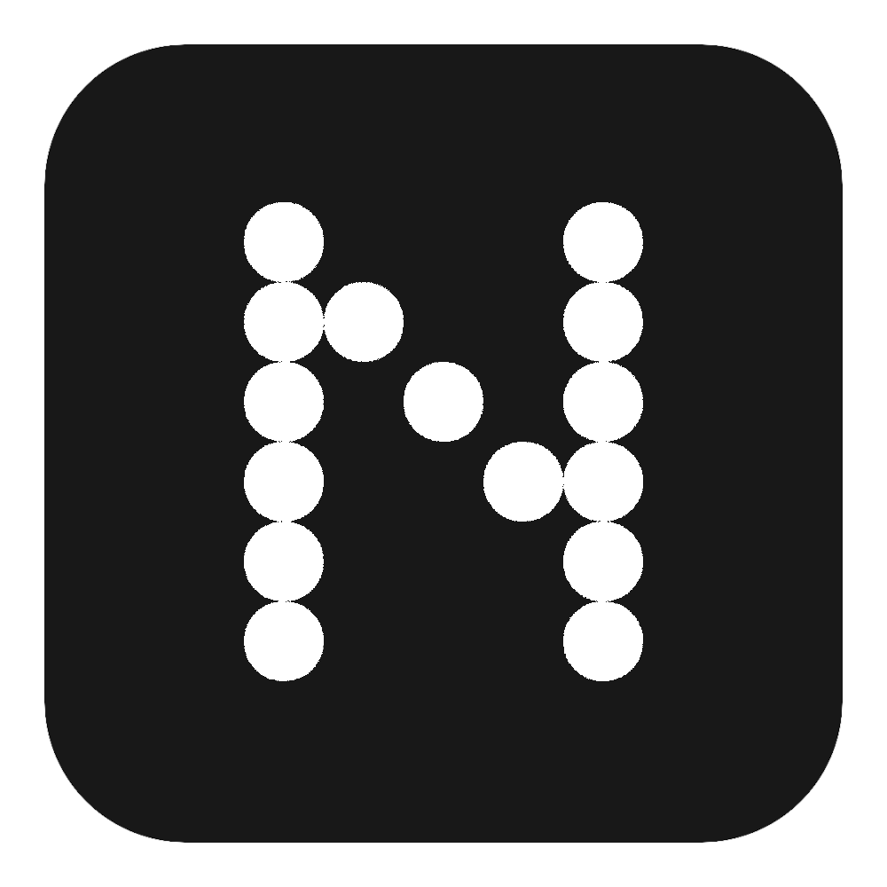
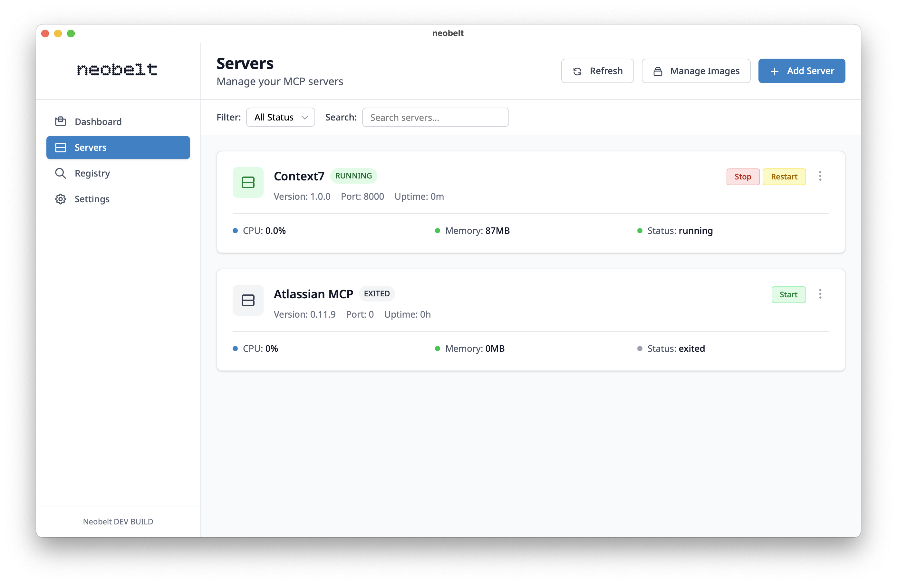

<div align="center">
  
  
  # Neobelt
  
  **The Ultimate MCP Server Management Tool**
  
  *Effortlessly manage, configure, and deploy Model Context Protocol servers with Docker*
  
  [](https://github.com/dennispaul/neobelt/releases)
  [](LICENSE)
  [](#installation)

  

</div>

## ✨ What is Neobelt?

Neobelt is a powerful desktop application that simplifies the management of **Model Context Protocol (MCP) servers**. Whether you're a developer working with AI tools or a manager wanting to try out the latest MCP servers, Neobelt provides an intuitive interface to deploy, configure, and run your servers with ease.

## 🚀 Key Features

### 🐳 **Docker-Powered Backend**
- Seamless Docker integration for reliable server deployment
- Automated container management and lifecycle control
- Resource monitoring and health checks

### 🎯 **Server Registry System**
- Browse curated MCP servers from the built-in registry
- One-click installation of popular MCP tools
- Support for custom registry endpoints

### ⚙️ **Intuitive Configuration**
- Visual environment variable management
- Port and volume mapping made simple
- Real-time configuration validation

### 🔧 **Complete Server Lifecycle Management**
- Install → Configure → Deploy → Monitor
- Start, stop, and restart servers with a single click
- Comprehensive logging and status monitoring

### 🤖 **Claude Desktop Integration**
- Seamless integration with Claude Desktop application
- Automatic registration of MCP servers in Claude's configuration
- One-click deployment directly to Claude Desktop
- Auto-detection of Claude Desktop configuration paths across platforms
- **Perfect for enterprise teams** - Works with Claude Desktop Teams licenses that only support stdio connections

### 🌉 **Built-in MCP-Proxy**
- Bridge stdio-based MCP servers to HTTP endpoints
- **Essential for Claude Desktop integration** - Claude Desktop requires stdio connections
- Support for custom headers and authentication
- JSON-RPC 2.0 message forwarding
- Command-line proxy mode for advanced use cases

### 🖥️ **Cross-Platform Desktop App**
- Native performance on Windows, macOS, and Linux
- Clean, modern interface built with Wails and Go
- Responsive design that scales with your workflow

## 📦 Quick Start

### Prerequisites
- Docker Desktop installed and running
- Go 1.23+ (for development)

### Installation

1. **Download the latest release** for your platform from [Releases](https://github.com/dennispaul/neobelt/releases)

2. **Install and run** Neobelt

3. **Connect to Docker** - Neobelt will automatically detect your Docker installation

4. **Browse servers** - Explore available MCP servers from the built-in registry

5. **Deploy with one click** - Select, configure, and deploy your first MCP server

6. **Integrate with Claude Desktop** - Enable Claude integration to automatically register servers with Claude Desktop

## 🏗️ Development

### Building from Source

```bash
# Clone the repository
git clone https://github.com/dennispaul/neobelt.git
cd neobelt

# Install dependencies
npm install

# Run in development mode
wails dev

# Build for production
wails build

# Use MCP-Proxy standalone
./neobelt --mcp-proxy -h "Authorization: Bearer TOKEN" https://mcp-server.tld/mcp
```

### Project Structure

```
neobelt/
├── frontend/          # Web frontend (HTML, CSS, JS)
├── internal/          # Go backend modules
├── build/             # Build assets and icons
├── docs/              # Documentation and examples
├── main.go            # Application entry point
└── CLAUDE.md          # Because Claude Code builds better frontends than I do. Don't judge me.
```

## 🌟 You want to add a new MCP server?

Submit a PR with your changes to the docs/registry.json file.

## 🤝 Contributing

We welcome contributions! Here's how you can help:

1. **Report Issues** - Found a bug? [Open an issue](https://github.com/dennispaul/neobelt/issues)
2. **Submit Pull Requests** - Have a feature or fix? We'd love to review it
3. **Share Feedback** - Let us know how you're using Neobelt
4. **Add MCP Servers** - Help expand our registry of available servers

## 📋 Roadmap

- [ ] Remote Access functionality for enabling remote access to MCP servers. Stay tuned!

## 🛠️ Tech Stack

- **Backend**: Go, Wails v2, Docker SDK
- **Frontend**: Vanilla JavaScript, Tailwind CSS
- **Configuration**: Viper
- **Packaging**: Cross-platform native binaries

## 📄 License

This project is licensed under the MIT License - see the [LICENSE](LICENSE) file for details.

## 🔗 Links

- **Documentation**: [View Docs](docs/)
- **Registry**: [Registry Docs](docs/registry.md)
- **Issues**: [GitHub Issues](https://github.com/dennispaul/neobelt/issues)
- **Releases**: [Download Latest](https://github.com/dennispaul/neobelt/releases)

---

<div align="center">
  
  **Made with ❤️ by [Dennis Paul](mailto:dennis@paul.hamburg)**
  
</div>